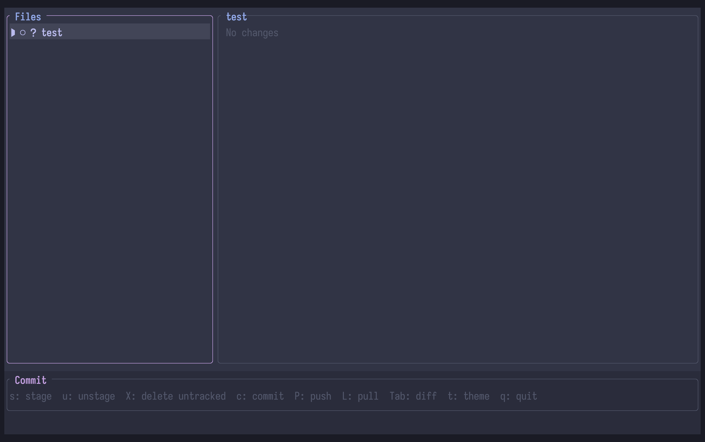

# gitish



A terminal-based git staging UI written in Rust. Think `git add -p` but interactive — browse unstaged and staged hunks side-by-side, stage or discard individual changes, compose a commit message, and push, all without leaving the terminal.


## Features

- **Two-panel layout** — file list on the left, diff on the right
- **Hunk-level staging** — stage or unstage individual hunks, not just whole files
- **Staged / unstaged diff view** — see what's already in the index and what isn't, in the same panel
- **Commit composer** — title + optional body, committed on Enter
- **Push / pull** — `P` to push, `L` to pull
- **Catppuccin theming** — four variants (Mocha, Macchiato, Frappe, Latte), persistent across sessions
- **Transparent background** — opt in via config to blend with your terminal's compositor transparency
- **Nerd font icons** — distinct glyphs for new, modified, deleted, and untracked files; staged/partial/unstaged states

## Keybindings

| Key | Action |
|-----|--------|
| `Tab` | Switch focus between file list and diff panel |
| `j` / `↓` | Move down |
| `k` / `↑` | Move up |
| `n` / `p` | Next / previous hunk |
| `s` | Stage hunk (diff panel) or whole file (file panel) |
| `u` | Unstage hunk or whole file |
| `d` | Discard hunk |
| `c` | Open commit composer |
| `P` | Push |
| `L` | Pull |
| `t` | Open theme picker |
| `q` / `Ctrl-c` | Quit |

## Installation

### With Nix (recommended)

```bash
git clone https://github.com/westongpt/gitish
cd gitish
nix develop
cargo install --path .
```

### Without Nix

Requires: `pkg-config`, `openssl`, `libgit2`

```bash
cargo install --path .
```

## Usage

Run from inside any git repository:

```bash
gitish
```

## Configuration

Config file: `~/.config/gitish/config.toml`

```toml
theme = "Catppuccin Mocha"   # Mocha | Macchiato | Frappe | Latte
transparent = false           # set true to pass background through to compositor
```

Themes are stored as base16 YAML files in `~/.config/gitish/themes/`. Drop any base16-compatible theme file there and it will appear in the picker (`t`).

## Stack

| Concern | Choice |
|---------|--------|
| TUI | `ratatui` + `crossterm` |
| Git backend | `git2` (libgit2) |
| Error handling | `thiserror` |
| Config | `serde` + `toml` + `dirs` |
